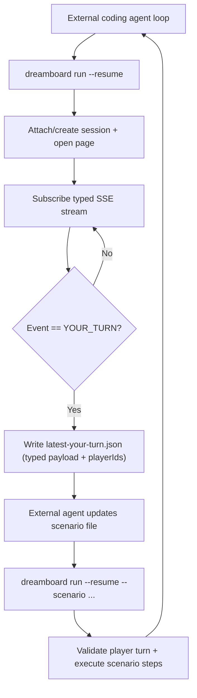

# Dreamboard CLI Observe/Act Multiplayer Loop Design

## Status

Proposed

## Date

2026-02-20

## Owner

Dreamboard CLI

## Problem Statement

`dreamboard run` currently creates a session, starts the game, opens Playwright, and only performs actions when `--scenario` is provided. Without a scenario file, the command blocks and does not provide a structured event/state loop for coding agents.

Current behavior is concentrated in:

1. `apps/dreamboard-cli/src/commands/run.ts`
2. `apps/dreamboard-cli/src/ui/playwright-runner.ts`

SSE is already available and strongly typed through the public generated API client:

1. `packages/api-client/src/types.gen.ts`
2. `packages/api-client/serverSentEvents.ts`
3. `apps/backend/src/main/kotlin/routes/sessions/GameSessionEventsController.kt`

## Requirements From Product Direction

1. No in-process `agent.decide` callback inside CLI.
2. Main loop is external (coding agent or operator repeatedly invokes CLI).
3. Multiplayer must be first-class.
4. Agent should only be asked to act when `YOUR_TURN` is received.
5. `playerId` must be explicit in turn context.
6. Game state passed to agent must use generated strong types.

## Non-Goals

1. Embedding an LLM runtime into CLI process.
2. Replacing existing scenario automation format in one step.
3. Requiring backend API changes to start rollout.

## Current State Context

## CLI command

`apps/dreamboard-cli/src/commands/run.ts` currently:

1. Resolves compiled result.
2. Creates session.
3. Starts game.
4. Opens Playwright page.
5. Runs scenario if `--scenario` exists.
6. Otherwise idles.

## SSE in CLI

`apps/dreamboard-cli/src/ui/playwright-runner.ts` currently:

1. Has `listenToSessionEvents(sessionId, signal, onEventType)`.
2. Emits only event type string to callback.
3. Drops event payload for downstream logic.
4. Uses loose cast `(event as { type?: string })`.

## Backend event guarantees

`apps/backend/src/main/kotlin/routes/sessions/GameSessionEventsController.kt`:

1. Sends bootstrap `GAME_STARTED` at gameplay connection start.
2. Streams user-addressed messages with SSE `id`.
3. Supports replay via `lastMessageId`.

This is enough to implement resumable observe/act loops without server changes.

## Proposed User Workflow

External coding agent loop:

1. Run `dreamboard run --resume`.
2. CLI blocks on SSE and exits when `YOUR_TURN` (or `GAME_ENDED`/timeout).
3. CLI writes typed turn context file with `playerId` candidates and `gameState`.
4. Coding agent reads turn context and updates scenario file.
5. Run `dreamboard run --resume --scenario <file>`.
6. CLI validates turn ownership and executes scenario steps.
7. Repeat.

## High-Level Architecture



## Detailed Design

## 1) Single command behavior (no modes)

Keep only one `run` behavior:

1. Ensure session exists (`--resume` default true, create if missing).
2. Subscribe to SSE and wait until stop condition (`YOUR_TURN` by default).
3. Persist typed context artifacts.
4. If `--scenario` is provided, execute all steps in the scenario file.
5. Exit with run summary.

This removes `--mode` entirely and keeps the external loop simple.

## 2) Session continuity across invocations

Add persisted session state file:

1. Default path: `.dreamboard/run/session.json`
2. Contents:
   1. `sessionId`
   2. `shortCode`
   3. `gameId`
   4. `compiledResultId`
   5. `createdAt`
   6. `lastEventId` (optional)
   7. `controllablePlayerIds` (from latest `GAME_STARTED`)

Behavior:

1. `--resume` (default true): reuse existing active session if present.
2. `--new-session`: ignore persisted state and create fresh session.
3. On each run, update `lastEventId` for replay/resume.

## 3) Typed event observer

Replace event-type-only callback with typed event stream utility.

New module:

1. `apps/dreamboard-cli/src/services/run/event-observer.ts`

Responsibilities:

1. Subscribe with `subscribeToSessionEvents`.
2. Receive `GameMessage` payloads (no untyped cast).
3. Capture SSE metadata via `onSseEvent` to retain `eventId`.
4. Print compact event lines for agent visibility.
5. Append NDJSON event logs.

Suggested event record:

```ts
type ObservedEventRecord = {
  observedAt: string;
  sessionId: string;
  eventId: string | null;
  type: GameMessage["type"];
  message: GameMessage;
};
```

## 4) Turn context artifact for external agent

Write turn context file on `YOUR_TURN`:

1. Default path: `.dreamboard/run/latest-your-turn.json`
2. Source type: generated `YourTurnMessage`.

Suggested shape:

```ts
type PersistedYourTurnContext = {
  sessionId: string;
  shortCode: string;
  eventId: string | null;
  observedAt: string;
  controllablePlayerIds: string[];
  activePlayers: string[];
  eligiblePlayerIds: string[];
  message: YourTurnMessage;
};
```

Eligibility rule:

1. `eligiblePlayerIds = controllablePlayerIds ∩ message.activePlayers`

The file gives external agents one strongly typed payload to reason over.

## 5) Multiplayer action gating

When `--scenario` is provided, action execution must run only when turn context allows action.

Validation sequence:

1. Load `latest-your-turn.json`.
2. Verify the first scenario step `playerId` is in `eligiblePlayerIds`.
3. Verify every scenario step `playerId` is in `controllablePlayerIds`.
4. For `--scenario-driver ui`, verify all scenario steps target the same `playerId`.
5. Execute scenario step(s).
6. Optionally wait for post-action progress event before exit.

This ensures no cross-player illegal actions in multiplayer sessions.

## 6) Scenario execution contract

Preserve existing UI step schema and add a narrow v2 extension.

Existing step support (already implemented):

1. Mouse/keyboard actions.
2. Turn waits.

Add optional step fields for turn-safe control:

1. `playerId?: string` to pin intended actor.
2. `waitForEvent?: GameMessage["type"]` to wait deterministic progress.

If `playerId` is provided, it must match `targetPlayerId`.

## 7) Output artifacts for agent loop

Default run artifact directory:

1. `.dreamboard/run/`

Files:

1. `session.json` - persisted session context.
2. `events.ndjson` - stream of typed message records.
3. `latest-your-turn.json` - latest actionable context.
4. `last-run-summary.json` - command inputs, exit reason, counts, timestamps.
5. `screenshots/` - optional snapshots.

## 8) Stop conditions and defaults

Run command should have explicit exits and defaults:

1. `--until YOUR_TURN|GAME_ENDED|ANY` (default `YOUR_TURN`)
2. `--timeout-ms <n>`
3. `--max-events <n>`

Exit reason should be machine-readable:

1. `until_reached`
2. `timeout`
3. `stream_closed`
4. `error`

Recommended defaults:

1. `--resume=true`
2. `--headless=true`
3. `--until=YOUR_TURN`

## 9) Strong typing requirements

All event processing should be typed from generated SDK:

1. `GameMessage`
2. `YourTurnMessage`
3. `SimpleGameState`
4. `ActionDefinition`

No plain `Record<string, unknown>` for event payloads in the new run runtime.

## 10) Console output protocol

Observe output should be concise and parse-friendly:

1. One line per event: timestamp, eventId, type.
2. On `YOUR_TURN`, print:
   1. active players
   2. controllable players
   3. eligible players
   4. action count
3. Print artifact file paths at exit.

## File-by-File Change Plan

## Must update

1. `apps/dreamboard-cli/src/commands/run.ts`
2. `apps/dreamboard-cli/src/flags.ts`
3. `apps/dreamboard-cli/src/types.ts`
4. `apps/dreamboard-cli/src/ui/playwright-runner.ts`
5. `apps/dreamboard-cli/README.md`
6. `apps/dreamboard-cli/skills/dreamboard/references/scenario-format.md`

## New files

1. `apps/dreamboard-cli/src/services/run/session-state.ts`
2. `apps/dreamboard-cli/src/services/run/event-observer.ts`
3. `apps/dreamboard-cli/src/services/run/turn-context.ts`
4. `apps/dreamboard-cli/src/services/run/run-summary.ts`

## Optional later

1. `apps/dreamboard-cli/src/services/run/scenario-v2.ts`

## API and Backend Impact

## Backend changes required now

None required.

## Backend changes that may help later

1. Add explicit event index to payload body (currently only SSE metadata has ID).
2. Add server-side action trace correlation ID for easier loop debugging.

## Error Handling and Recovery

1. If session resume fails, CLI can:
   1. fail hard by default, or
   2. create new session when `--resume-fallback-new` is set.
2. If no `YOUR_TURN` before timeout, persist summary and exit with non-zero code.
3. If turn context is stale (e.g., mismatched event replay), re-run without `--scenario` to refresh context.

## Rollout Plan

## Phase 1: Core wait-and-observe behavior

1. Implement defaults and session persistence.
2. Implement typed observer + NDJSON logging.
3. Implement `YOUR_TURN` context artifact.

## Phase 2: Scenario action integration

1. Integrate scenario execution into same command.
2. Add player eligibility checks.
3. Support mixed-player API scenarios in one run.

## Phase 3: Scenario v2 enrichments

1. Add `playerId` and `waitForEvent` fields.
2. Improve deterministic waits and failure diagnostics.

## Validation Plan

Manual validation matrix:

1. Single-player game, observe until `YOUR_TURN`, verify turn context file.
2. Multiplayer game where user controls multiple seats, verify eligible player list.
3. Mixed-player API scenario should validate each step against controllable players.
4. UI scenario with mixed players should fail with clear guidance.
5. Repeated observe/act invocations should keep same session when `--resume` is true.
6. Replay continuity should use `lastEventId` and avoid duplicated decision context.
7. Game end should exit when `GAME_ENDED` is received.

## Risks and Mitigations

1. Risk: stale session state file.
   1. Mitigation: validate session status at run start.
2. Risk: event duplication on reconnect.
   1. Mitigation: persist `lastEventId` and dedupe by `(sessionId,eventId)`.
3. Risk: ambiguous player in multiplayer.
   1. Mitigation: strict `eligiblePlayerIds` and required explicit selection when needed.

## Example Main Loop Script (External Agent Concept)

```bash
# 1) Observe until actionable state
dreamboard run --until YOUR_TURN --resume --headless

# 2) External coding agent reads:
#    .dreamboard/run/latest-your-turn.json
#    .dreamboard/run/events.ndjson
#    and updates scenario file.

# 3) Execute one step
dreamboard run --scenario .dreamboard/scenario.json --resume --headless

# 4) Repeat
```

## Open Questions

1. Should `--resume` default to true or false for safety?
2. Should `act` mode require browser UI always, or allow API-only fast path?
3. Should `run` auto-capture screenshot when `YOUR_TURN` arrives?
4. Should CLI keep a bounded event log window in addition to NDJSON file?
