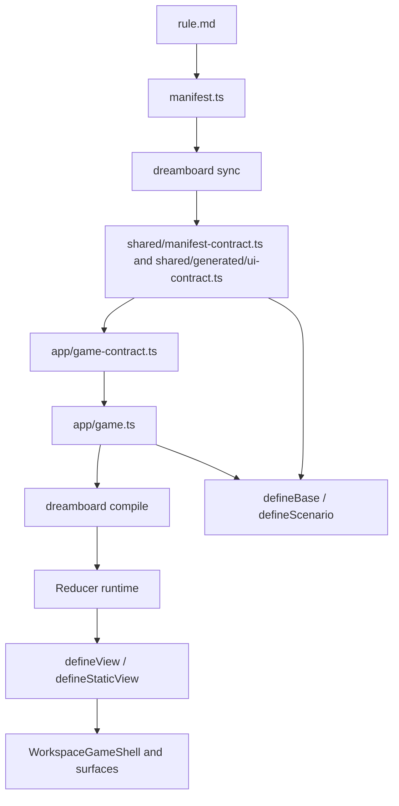

# Authoring lifecycle

See how authored Dreamboard files flow through sync, compile, runtime, UI projection, and tests.

Dreamboard has one canonical lifecycle: author static structure, bind it into a reducer contract, register runtime behavior, project UI state, then verify it with generated tests.



## 1. Author the manifest

Start with `manifest.ts`. The manifest names the table pieces that the rest of the project should refer to: player ids, card ids, zone ids, board ids, resource ids, setup options, and setup profiles.

After a manifest change, run:

```bash
dreamboard sync
```

`sync` regenerates the manifest contract. If you renamed a zone, any reducer/UI/test code still using the old zone id should fail to compile.

## 2. Bind the reducer contract

`app/game-contract.ts` imports `manifestContract` and calls `defineGameContract`.

This is where authored state starts:

- `public` for state every player can see
- `private` for per-player secrets
- `hidden` for game-owned secrets
- `phaseNames` for the legal phase-name union

Use manifest-backed schemas from `gameContract.schemas` or generated `ids` so state and params stay tied to the manifest.

## 3. Define phases and interactions

Phases define game flow. Interactions define what players can submit.

The runtime path for an interaction is:

1. Find the active phase.
2. Check actor authorization.
3. Parse client params from collectors.
4. Validate board/card/choice targets from target rules.
5. Run `available` and `validate`.
6. Call `reduce`.
7. Apply returned state and queued runtime instructions.

The UI should not reimplement this. It reads descriptors and eligible targets generated from the same interaction definition.

## 4. Project views

Use `defineView` for dynamic per-player payloads. Use `defineStaticView` for immutable session payloads.

Dynamic views can see state and `playerId`; static views cannot. That split keeps large static topology out of every runtime update.

## 5. Render UI surfaces

The generated UI contract creates typed interaction keys and a typed `WorkspaceGameShell`. Surface configuration maps reducer interactions to UI components.

Prefer generated surfaces first. Add custom renderers when the game needs domain-specific visuals, not to reimplement validation or turn logic.

## 6. Test the reducer

Run:

```bash
dreamboard test generate
dreamboard test run
```

`test generate` writes workspace-narrowed test types from the current game definition. Scenarios submit typed interactions and assert against reducer state and projected views.

If tests fail after a manifest or reducer change, regenerate the testing contract before assuming the scenario logic is wrong.
